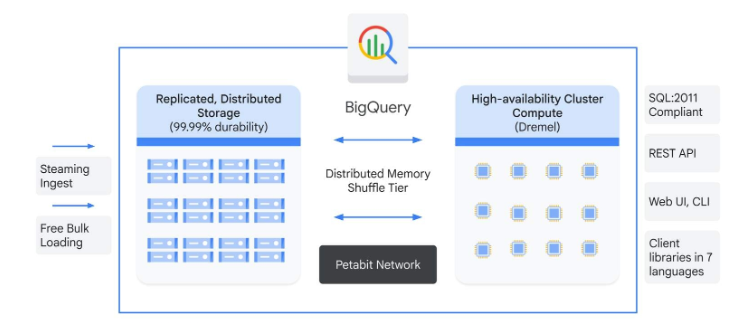

# Build Data Lakes and Data Warehouses on Google Cloud
## Chapter 1
### Introduction to Modern Data Engineering on Google Cloud
#### The classics: Data lakes and data warehouses
For years, organizations have relied on two primary methods for large-scale data storage: data lakes and data warehouses.

They serve different purposes and are optimized for different kinds of data and workloads. To understand them, let's consider the example of Cymbal, a major e-commerce company.

##### Data lakes
Think of a data lake as a vast reservoir of data. It stores enormous amounts of raw data in its native format. You can pour any kind of data into it; structured, semi-structured, and unstructured.

For Cymbal, this means storing:
1. Structured data, like transaction tables from its sales database.
1. Semi-structured data, like JSON logs from its web servers.
1. Unstructured data, like customer-submitted product images, videos, and text reviews.

Data lakes are created on the premise of "store everything now, figure out how to use it later." With this approach, you apply a structure to the data when you read it (schema-on-read), not when you store it.

This makes data lakes ideal for data exploration, machine learning, and big data processing. Cymbal's data scientists, for example, need access to original, unaltered clickstream data to build a new recommendation engine.

###### Advantages of data lakes
1. Flexibility: Stores all data types.
1. Agility: Fast to ingest data.
1. Scalability: Can grow to exabyte scale.
1. Cost-effectiveness: Uses low-cost object storage.
1. Support for advanced analytics: Ideal for AI/ML model training.

###### Disadvantages of data lakes
1. Risk of becoming a "data swamp": Without proper governance, it can become a disorganized collection of unusable data.
1. Management complexity: Requires significant overhead to maintain.
1. Time-consuming analysis: Data often needs to be cleaned and wrangled before it is usable.
1. Security risks: Raw data formats can increase security and compliance risks.

#### The modern approach: Data lakehouse
A **data lakehouse** architecture combines the low-cost storage of a data lake with the management features and query performance of a data warehouse. The goal is to create a single, unified platform that can support traditional BI, modern data science, and AI workloads without moving or duplicating data.

A lakehouse achieves this by implementing a metadata and governance layer on top of open-format files stored in low-cost object storage, like Google Cloud Storage. This gives you the best of both worlds.


For Cymbal, a lakehouse solves a key challenge: breaking down data silos. Previously, its sales data was in a warehouse and its customer review data was in a data lake.

The two could not be analyzed together easily. With a lakehouse, Cymbal can now run a single query to correlate customer sentiment from text reviews with sales trends from its transaction database.

##### Key feautures of a Google Cloud data lakehouse
1. Support for most data formats
1. Flexible schema-on-read or schema-on-write
1. Access for all types of data users
1. Cost flexibility based on needs
1. Unified data governance
1. ACID transaction support

Google Cloud implements **data lakehouses** through BigLake technology. BigLake allows you to apply Google Cloud’s governance and query capabilities to data stored in Google Cloud or even in other major clouds. You can manage and query your data where it lives, using open formats like Parquet, ORC, and Avro, while benefiting from BigQuery's powerful and flexible query engine.

Data lakehouses solve many challenges by unifying data storage and access.
The benefits include:

* Reduced data redundancy
* Unified governance
* Broken-down data silos
* Improved flexibility and scalability

#### Choosing the right architecture
While a data lakehouse is the newest approach, a data lake or a data warehouse might be a better fit for your specific needs. Let’s consider when each approach might be the best choice for Cymbal.

Consider a data warehouse, like BigQuery, when the primary need is high-speed, interactive BI on structured business data, such as for Cymbal's finance department.

Consider a data lake, using Cloud Storage, for the initial, low-cost storage of massive volumes of raw data. This is ideal for Cymbal's AI/ML research and development where the data's final use is not yet defined.

Adopt a data lakehouse architecture with BigQuery and BigLake when you need to do it all: support BI, AI, and data science on a single, governed copy of your data, providing a holistic view for the entire company.

## Chapter 2
### Building a data lake foundation
From customer purchase history and website clicks to supply chain logistics and marketing campaign performance, Cymbal generates massive amounts of diverse data. A robust data architecture is essential to make informed business decisions, personalize customer experiences, and optimize operations.

A data lakehouse combines the key features of data lakes and data warehouses. It offers the flexibility and scalability of a data lake for storing raw, unstructured, or structured data, with the schema enforcement and query performance of a data warehouse. This hybrid approach allows organizations like Cymbal to handle all their data needs in one unified system.

Google Cloud provides a powerful set of tools to build this unified architecture. The primary storage for your data lakehouse is Cloud Storage. Cloud Storage is a massively scalable, highly durable, and cost-effective object storage service. Cymbal can use it to store almost any type of data file, regardless of its size or format. However, you are not limited to using Cloud Storage. If your strategy is multi-cloud, you can keep your data in another major provider's cloud storage.

One of the biggest advantages of Cloud Storage is its ability to store multimodal data. This means you can store data in various formats and structures in one place. For Cymbal, this is incredibly valuable.

#### Structured Data Files
Structured data is information that is highly organized into a predefined format, much like a spreadsheet with clear rows and columns. At Cymbal, this includes essential data like customer lists, product catalogs, and sales transactions. Because it has a predictable model, this data is easy for computers to search, analyze, and process.

#### Semi-Structured Data Files
Semi-structured data is a blend of structured and unstructured data, as it doesn't have a rigid, predefined model but contains tags or other markers to create a hierarchy of records and fields. For example, Cymbal might receive order details as a JSON file, which has a consistent overall structure but allows for variations in the specific information included for each product.

#### Unstructured Data Files
Unstructured data is information that doesn't have any predefined organizational structure. For Cymbal, this includes a wealth of valuable information like the text from customer product reviews, support chat logs, and product images. While this data is more complex to process, it holds key insights that can be unlocked with modern analytics and AI tools.


Cloud Storage can handle all of these data types. It provides the flexibility to store raw, unprocessed data as it arrives, without needing to define its structure beforehand. This is crucial for Cymbal as they continuously collect new types of data and want to analyze it later without immediate transformations.

### Introduction to Apache Iceberg open table format
While Cloud Storage is excellent for storing raw files, a data lakehouse needs a way to bring structure and performance to this data. This is where open table formats come into play, and Apache Iceberg is a leading example.

Imagine Cymbal has millions of customer orders stored as files in Cloud Storage. If they want to query these orders efficiently, for example, to find all orders placed in the last week by customers in a specific region, traditional file-based queries would be slow. They would have to scan every file to find the relevant information.

Apache Iceberg solves this by adding a layer of metadata and structure on top of the files in Cloud Storage. It does not move your data; it organizes and manages it, acting as an index and catalog for your data files.

#### Features of Apache Iceberg
##### Schema evolution
Cymbal's data requirements change constantly. Iceberg lets them evolve their data schemas, such as adding new columns or renaming existing ones, without disrupting existing data or applications.

##### Hidden partitioning
Iceberg automatically manages how data is partitioned for efficient querying, which means Cymbal's analysts do not need to worry about the underlying file organization.

##### Time travel
This feature allows Cymbal to query past versions of their data. If a report was run last month, they can reproduce the exact data state from that time, which is invaluable for auditing and debugging.

##### Atomic transactions
Iceberg enables reliable, concurrent operations on the data, ensuring that multiple processes can read and write to the same tables without data corruption.

By using Apache Iceberg with Cloud Storage, Cymbal can treat their collection of data files as performant, queryable tables, bringing the benefits of a data warehouse to their flexible data lake.

#### BigQuery as the central processing engine
While Cloud Storage and Iceberg provide a flexible, open-standard foundation for storing vast amounts of raw and structured data, BigQuery is the high-performance engine that activates it. By creating BigLake tables, Cymbal can use BigQuery's familiar SQL interface to directly and securely query the Iceberg-formatted data in their Cloud Storage data lake.

This means they do not have to duplicate data or perform costly extract, transform, load (ETL) processes to run analytics. Analysts get the performance and features of a premier data warehouse while querying data directly in their open-format data lake.

Furthermore, BigQuery also provides its own optimized, managed storage. Cymbal can use this native storage for their most frequently accessed, or "hot," datasets that require the fastest query performance, like key marketing performance dashboards. This gives them a unified platform to analyze data in their data lake, in BigQuery's native storage, or both, all through a single interface.

#### Combining operational data in AlloyDB
While Cloud Storage and open table formats like Iceberg are ideal for large-scale analytical data, operational data that powers Cymbal's daily operations require a different solution. This is where AlloyDB for PostgreSQL is an excellent choice.

Operational data is the real-time, constantly changing information that drives Cymbal's immediate business processes.

This includes
* Customer order processing
* Inventory management
* User login information

These use cases require a database that can handle very high transaction volumes, provide extremely low latency for reads and writes, and ensure strong data consistency. Analytical databases are not designed for these real-time operational demands.

AlloyDB is a fully managed, PostgreSQL-compatible database service built for demanding enterprise workloads. It combines the familiarity and flexibility of PostgreSQL with the performance, availability, and scalability of the cloud for critical operational applications.

#### Combining operational and analytical data with federated queries
This feature allows Cymbal to query data in external systems, like their operational AlloyDB database, in real time without moving or copying it into BigQuery. This creates a bridge between their live operational data and their historical analytical data.

Here is how Cymbal would combine real-time inventory data from AlloyDB with historical sales data from their Iceberg tables:

1. First, a data administrator creates a secure connection resource in BigQuery. This connection contains the credentials and configuration details to allow BigQuery to communicate with Cymbal's AlloyDB instance. This is a one-time setup.
1. To access the AlloyDB data, an analyst uses the EXTERNAL_QUERY SQL function within a BigQuery query. This function takes two arguments: the connection ID and the query to be executed on the AlloyDB database.

#### Real world use case
Optimizing marketing and supply chain with a data lakehouse

Cymbal recently launched a major marketing campaign for its new "Evergreen" outdoor collection. To measure the campaign's true return on investment, their data team leveraged their Google Cloud data lakehouse with the goal of moving beyond simple sales metrics to understand the complete customer journey.

In summary, for Cymbal, a data lakehouse built with Cloud Storage as its foundation, enhanced by open table formats like Apache Iceberg, powered by BigQuery, and integrated with AlloyDB for critical operational data, provides a powerful, flexible, and future-proof data architecture. This setup enables them to leverage all their data assets, from raw multimedia to real-time transactions, to drive their business forward with smart decisions based on high quality data.

## Chapter 3
### BigQuery fundamentals
Cymbal collects massive amounts of data daily: sales transactions, website clicks, inventory levels, and customer feedback. A traditional, on-premises data warehouse might struggle to keep up with this volume and variety.

In the traditional data warehousing world, managing this kind of scale is a constant challenge.

Cymbal’s data architects would have to spend a significant amount of time on capacity planning. How many servers do we need for the upcoming holiday shopping season? How do we handle unexpected spikes in traffic? They would be responsible for provisioning hardware, installing and patching software, and manually rebalancing data as it grows. This operational overhead is not only expensive but also slows down the ability of the analytics teams to get timely insights.

This is the exact problem that BigQuery was designed to solve.

#### Fully managed
The infrastructure (like the hardware, the networking, the low-level software) is all handled by Google. Your team doesn't need to worry about patches, updates, or hardware failures.

#### Severless
Serverless takes things a step further. You don't have to provision or manage any servers at all. You simply load your data and start querying. BigQuery automatically allocates the necessary resources to run your queries and scales them up or down based on the complexity of your request.

The magic behind BigQuery is its architecture. BigQuery separates storage from compute.



Think of it like a library. The books are the data, stored reliably and inexpensively in Google's distributed file system. When you want to find specific information, the librarians are the compute resources. BigQuery can call upon thousands of librarians (or compute workers) simultaneously to scan the entire library (your data) very quickly. This distributed processing engine, called Dremel, is what makes your queries run so fast.

Because storage and compute are separate, they can scale independently. If Cymbal's data grows, more storage is automatically utilized. If they need to run more complex queries, they can use more compute power and only pay for it while the query is running, depending on your billing options. This separation is a game-changer for managing costs and ensuring performance.

Let's break down how BigQuery achieves its incredible speed by examining two core concepts: **slots** and **shuffle.**

#### What is a slot?
Think of a slot as a virtual worker—a small, self-contained unit of computational power that includes CPU, RAM, and network bandwidth. When you run a query, BigQuery's Dremel engine assigns potentially thousands of these slots to your job. Each slot processes a small piece of your data simultaneously. This is the "massively parallel processing" that allows BigQuery to scan terabytes of data so quickly.

#### What is shuffle?
When the results from all those parallel workers need to be combined, such as for a `GROUP BY` or a `JOIN`, the shuffle comes in. Shuffle is the process of redistributing the intermediate data that the slots have processed. Using Google’s petabit internal network, Jupiter, shuffle gathers and reorganizes this data, sending it to the next set of slots for further processing like aggregation or joining. This incredibly fast redistribution of data between query stages is essential for executing complex analytical queries efficiently at a massive scale.

BigQuery's groundbreaking separation of compute and storage is the key to its versatility in querying data from multiple sources. Think of the compute engine, Dremel, as a flexible data analyst that is not tied to a single filing cabinet.

### Partitioning and clustering in BigQuery
#### Partitioning
Partitioning is like adding dividers to a filing cabinet. Instead of one giant drawer, you have separate sections for each year, month, or day. In BigQuery, you can partition a table based on a date or an integer column.   

Let’s examine some dummy sales data from Cymbal at a small scale.

Dummy sales transactions table (Cymbal)

| transaction_date | customer_id | product_category | sales_amount |
| ---------------- | ----------- | ---------------- | ------------ |
| 8/1/2025 | CUST002 | Headsets | 52 |
| 8/1/2025 | CUST002 | Keyboards | 186 |
| 8/1/2025 | CUST003 | Headsets | 465 |
| 8/1/2025 | CUST005 | Headsets | 57 |
| 8/2/2025 | CUST003 | Shoes | 413 |
| … | … | … | … |

##### Partitioned views by transaction_date
###### Partition: 2025-08-01
| transaction_date | customer_id | product_category | sales_amount |
| ---------------- | ----------- | ---------------- | ------------ |
| 8/1/2025 | CUST002 | Headsets | 52 |
| 8/1/2025 | CUST002 | Keyboards | 186 |
| 8/1/2025 | CUST003 | Headsets | 465 |
| 8/1/2025 | CUST005 | Headsets | 57 |

###### Partition: 2025-08-02
| transaction_date | customer_id | product_category | sales_amount |
| ---------------- | ----------- | ---------------- | ------------ |
| 8/2/2025 | CUST003 | Shoes | 413 |
| 8/2/2025 | CUST002 | Headsets | 118 |
| 8/2/2025 | CUST004 | Consoles | 455 |

When you run a query that filters by a specific date range, like for sales from last week, BigQuery knows it only needs to scan the partitions for those specific days. It completely ignores all the other partitions, which drastically reduces the amount of data scanned. This makes your queries faster and cheaper.

#### Clustering
While partitioning divides the data into large chunks, clustering sorts the data within each of those chunks. Think of it as organizing the files within each drawer of your filing cabinet alphabetically by customer name.

For Cymbal, you might cluster a partitioned sales table by `customer_id` or `product_category`. If you run a query to find all purchases made by a specific customer within the last month, BigQuery first goes to the correct monthly partition.

##### Clustering example (partition: 2025-08-01, clustered by customer_id)
| transaction_date | customer_id | product_category | sales_amount |
| ---------------- | ----------- | ---------------- | ------------ |
| 8/1/2025 | CUST002 | Headsets | 52 |
| 8/1/2025 | CUST002 | Keyboards | 186 |
| 8/1/2025 | CUST002 | Headsets | 465 |
| 8/1/2025 | CUST002 | Headsets | 57 |


```SQL
SELECT *
FROM cymbal_sales
WHERE transaction_date = '2025-08-01'
  AND customer_id = 'CUST003';
```

Now because the data is sorted by `customer_id`, it can jump directly to the data for that customer instead of reading through the entire partition.

#### Partioning and Clustering in Iceberg
BigQuery works differently depending on whether you’re using its native tables or external Apache Iceberg tables stored in Cloud Storage.

##### Partitioning
When querying Apache Iceberg tables in Cloud Storage, BigQuery doesn't implement its own partitioning and clustering. Instead, it intelligently leverages the existing structure defined in the Iceberg table's own metadata, demonstrating the power of open standards.

With partitioning, the partitions are typically defined and written by a data processing engine like Apache Spark. For instance, a sales data table might be partitioned by transaction_date. The Iceberg metadata meticulously tracks which specific data files in Cloud Storage belong to which date.

When you run a query in BigQuery with a filter like WHERE transaction_date = '2025-08-15', BigQuery (via BigLake) first reads this metadata.

It instantly identifies the exact set of files corresponding to that date and prunes away all others. This tells the query workers to ignore irrelevant data, drastically reducing the amount of data scanned, which lowers costs and accelerates query performance.

##### Clustering
The concept of clustering in BigQuery is mirrored by data sorting and file-level statistics in Iceberg. The data within Iceberg's Parquet or ORC files is often sorted by specific columns, like customer_id.

The Iceberg metadata then stores statistics, such as the minimum and maximum customer_id values, for each individual data file.

##### Predicate Pushdown
If your BigQuery query filters for a specific customer, the query planner consults these statistics. It can then skip reading any files whose min/max range doesn't contain the requested customer_id, even if they are in the correct partition.

This powerful predicate pushdown provides a finer-grained level of data pruning, ensuring maximum query efficiency on your open data lakehouse.

Partitioning and clustering together give BigQuery fine-grained control over how your data is queried, leading to significant performance improvements and cost savings, especially as your data grows.

### Introducing BigLake and external tables
#### Data warehouse vs. data lake
Historically, enterprise data was managed in two distinct ways: the data warehouse - the traditional standard for decades - perfect for structured, curated data used for business intelligence, and the data lake, emerging around 2010 as low-cost repository for storing vast amounts of raw data in any format.

This separation, while logical, often leads to significant challenges. It creates data silos, making it difficult to analyze different types of data together. It requires building complex ETL pipelines to move and duplicate data from the lake to the warehouse, which introduces latency and increases costs. It also complicates data governance, as you have to manage security and access policies across two different systems. To solve these problems, a new architectural pattern has emerged: the lakehouse.

#### Lakehouse architecture
A lakehouse architecture combines the key benefits of both worlds: the low-cost, flexible storage of a data lake with the powerful querying, transaction management, and governance features of a data warehouse, all within a single, unified system. On Google Cloud, the service that makes this powerful architecture a reality is BigLake.

##### BigLake and external tables
BigLake acts as a storage engine and connector that allows you to extend the capabilities of BigQuery to your data in object storage, like Google Cloud Storage. BigLake lets you create tables in BigQuery that do not hold the data themselves but instead point to the data files living in your data lake. These are called external tables.

Let's consider how Cymbal can use this.

Cymbal's data science team stores raw, semi-structured web server log files in JSON format in a Cloud Storage bucket. To analyze this clickstream data, they would historically need a complex data pipeline to parse and load the data into BigQuery.

With BigLake, the process is much simpler. You can create a BigLake external table directly on top of the JSON files in Cloud Storage. Now, you can use the familiar BigQuery SQL interface to query this clickstream data instantly, as if it were a native BigQuery table.

You can even join this external table with a native BigQuery sales table to discover correlations between website behavior and purchasing habits, without ever moving or duplicating data.

##### Governance and security
One of the most powerful features of BigLake is how it centralizes governance and security. You can apply fine-grained security controls, including row-level and column-level security, directly on the BigLake tables within BigQuery. This is enabled through access delegation.

When you create a BigLake table, you associate it with a service account that has permission to read the underlying data in Cloud Storage. The end-user querying the table only needs permission on the BigQuery table, not on the Cloud Storage bucket. This means Cymbal's governance team can grant a marketing analyst access to query only specific columns, like product_page_url and timestamp, while masking sensitive PII columns like ip_address. The analyst gets the data they need, but can never bypass BigQuery security controls to access the raw files in the lake.

#### Open standards
Open standards like Apache Iceberg ensure your data is flexible, interoperable, and not locked into one vendor. Let’s explore what Iceberg brings to a lakehouse and how BigQuery with BigLake supports it.

Lakehouses rely on open, standardized formats to avoid lock-in and ensure interoperability.

Iceberg brings the reliability of traditional SQL tables to your data lake, with features like ACID transactions, schema evolution, and time travel.

BigQuery, through BigLake, offers first-class, native support for Apache Iceberg. This is a game-changer. Cymbal can have their Spark jobs write data into Iceberg-formatted tables in their Cloud Storage data lake. Then, they can register that Iceberg table with BigLake, and it instantly becomes available for high-performance querying inside BigQuery.


You are not limited to just reading the data. You can run UPDATE, DELETE, and MERGE statements directly from BigQuery on your Iceberg tables. This means Cymbal's data engineering team can perform data corrections or handle right-to-be-forgotten requests on their data lake data using standard SQL in BigQuery.

By embracing BigLake and open formats like Iceberg, Cymbal can build a truly unified and open data platform. They get a single pane of glass for analytics, a consistent governance model across all their data, and the flexibility to use the best tool for the job, whether that's Spark for data processing or BigQuery for interactive analytics, all operating on a single source of truth.


## Chapter 4
### Advanced lakehouse patterns and data governance
#### Data governance and security in a unified platform
For a global online retailer like Cymbal, managing data responsibly is not just a technical task, it is a core business function.

They handle vast amounts of customer data, sales transactions, and inventory information. Ensuring this data is accurate, discoverable, and secure is crucial for personalized marketing and efficient supply chain management.

Dataplex – The metadata hub
Select each accordion heading to expand and read more details.

##### Metadata
Metadata is data about data. It identifies:
* who created the data,
* when it was created,
* what it contains,
* how it relates to other data,
* who owns it, and
* its security sensitivity.
##### Dataplex for your Organization
Without a centralized metadata system, data management can be difficult. Dataplex provides a unified metadata hub. For Cymbal, Dataplex acts as a universal catalog for all their data assets, whether they reside in BigQuery, Cloud Storage, or BigLake.

For Cymbal's data analysts, this centralized catalog is critical. Instead of searching through different systems to find the required datasets, they use the Dataplex catalog to discover data, understand data lineage, and manage and augment metadata.

##### Business Impact
By providing a single reference source, Dataplex helps Cymbal manage data at scale while ensuring consistency and quality.

#### Sensitive Data Protection
Cymbal has a responsibility to protect its customers' sensitive information, such as names, addresses, and credit card numbers. A data breach can damage their reputation and lead to significant financial penalties. Sensitive Data Protection is an essential tool for this purpose.

* Sensitive Data Protection allows Cymbal to automatically discover, classify, and protect sensitive data across their lakehouse. Let's learn more about each function.
* Discovery: Cymbal runs scans on BigQuery tables and Cloud Storage buckets to identify sensitive data. For example, they can configure a scan to look for patterns that match credit card numbers or email addresses.
* Classification: Once identified, data is classified by sensitivity level. This ensures the right security controls are applied.
* Protection: For protection, Cymbal can use techniques like masking or tokenization to de-identify the data. For instance, a customer support representative might only see the last four digits of a credit card number, while the full number is replaced with a non-sensitive token.


#### Identity and Access Management (IAM)
Controlling data access is a cornerstone of effective governance. Identity and Access Management (IAM) in Google Cloud provides the foundation for access control.

Cymbal follows the principle of least privilege, meaning users are given only the minimum access necessary to perform their jobs. For their lakehouse, this translates to specific IAM best practices for each Google Cloud service.

##### Cloud Storage
* Access controlled at the bucket level.
* Typically restricted to engineers and service accounts responsible for data ingestion.

##### BigQuery
* Granular IAM control at dataset and table level.
* Analysts: read-only access to curated sales data.
* Data scientists: create/modify tables in sandbox datasets.

##### BigLake
Extends BigQuery’s fine-grained security to Cloud Storage data. This provides a significant advantage.

#### Fine-grained security
Cymbal applies row-level and column-level security for even greater control:

Column-level security: Restricts access to specific columns in a table. For example, a marketing analyst might be able to access a customer's purchase history but not their contact information. This is effective for protecting Personally Identifiable Information (PII).

Row-level security: Filters which rows a user can access. A regional sales manager for North America, for instance, would only have access to sales data for that region. This is particularly useful for large, multinational companies like Cymbal.

For BigLake tables in Cloud Storage, dynamic data masking can also be applied.

#### Data Loss Prevention
In this scenario, Cymbal has launched a new loyalty program. New customer information has been collected and loaded into a BigQuery table named loyalty_program_customers. This table contains standard information, such as names and purchase histories, and also includes potentially sensitive data, such as email addresses, phone numbers, and free-text comments from customer feedback surveys.

Before this data is made available to the marketing analytics team, any PII must be properly handled to avoid exposing sensitive customer details in analytics dashboards.

#### Analytics and machine learning on the lakehouse
A secure and well-governed data lakehouse gives Cymbal the foundation to generate powerful insights and predictions with machine learning.

Traditionally, building ML models required moving data from a data warehouse into a separate environment. This process was often slow, expensive, and created data silos.

In this lesson, you’ll explore how the Google Cloud lakehouse architecture enables Cymbal to perform advanced analytics and machine learning directly on its data. This approach is faster, more efficient, and more accessible.

##### BigQuery ML: Machine learning for data analysts
One of the most powerful tools in the Google Cloud analytics toolkit is BigQuery ML.
It allows data analysts and data scientists at Cymbal to build and deploy machine learning models using simple SQL queries. This makes machine learning accessible to more people, so you don't need to be an expert in Python or TensorFlow to create valuable predictive models.

To identify customers who are at risk of not making another purchase, the marketing analytics team can use BigQuery ML and a few SQL statements.

###### Feature engineering

The first step is to prepare the data. The analysts write a SQL query to create features, or signals, that might predict churn.

These could include the following fields:
* recency: days since last purchase
* frequency: purchases in the last year
* monetary_value: total spent
* days_since_first_purchase: customer tenure

###### Model training
After the features are ready, they train a model with a single CREATE MODEL statement in SQL. For this binary classification problem (churn or no churn), a logistic regression or a boosted tree model is a good choice.

Review the sample code below.

```SQL
CREATE OR REPLACE MODEL cymbal_ecommerce.customer_churn_predictor
OPTIONS(model_type='LOGISTIC_REG') AS
SELECT
customer_id,
recency,
frequency,
monetary_value,
(total_purchases > 1) AS will_return -- This is our label
FROM
cymbal_ecommerce.customer_purchase_summary;
```

###### Model evaluation
After the model is trained, the analysts evaluate its performance using the ML.EVALUATE function. This provides metrics like accuracy, precision, and recall helping them understand how well the model is performing.

###### Prediction
The final step is to use the model to make predictions on new data. With the ML.PREDICT function, they can get a list of all customers and their probability of churning. This list can then be used to create targeted marketing campaigns to re-engage at-risk customers.

##### Integrating with Vertex AI for advanced ML
While BigQuery ML is ideal for many use cases, you sometimes need the power and flexibility of a comprehensive machine learning platform. For these situations, you can use Vertex AI. Vertex AI is the Google Cloud end-to-end platform for building, deploying, and managing ML models.

A key advantage of the Google Cloud lakehouse is the seamless integration between BigQuery and Vertex AI. Data scientists at Cymbal can use this integration for more complex projects, like building a product recommendation engine.

###### Data exploration and preparation in BigQuery
Data scientists start by exploring the purchase history data in BigQuery. They might use the built-in notebook environment, which is powered by Vertex AI Notebooks, to write Python code and SQL queries to analyze and prepare the data for training.

###### Training a custom model in Vertex AI
For a recommendation engine, they might build a custom model using a library like TensorFlow or PyTorch. They can use Vertex AI Training to run their training code on a managed, scalable infrastructure. Vertex AI can automatically provision the necessary compute resources, and the training job can read data directly from BigQuery, which eliminates the need for manual data extraction.

###### Model registration and deployment
After the model is trained, it's registered in the Vertex AI Model Registry. The registry provides a central place to manage and version all of their models. From the registry, they can deploy the model to an endpoint with a single click. This endpoint provides a REST API that the Cymbal website can call to get real-time product recommendations for each user.

###### MLOps and model monitoring
Vertex AI also provides a suite of MLOps tools to automate and monitor the entire machine learning lifecycle. They can set up pipelines to automatically retrain and redeploy their recommendation model as new purchase data becomes available. They can also monitor the model for issues like prediction drift to ensure that its performance doesn't degrade over time.


By combining the data warehousing power of BigQuery with the advanced ML capabilities of Vertex AI, Cymbal can build sophisticated, production-grade machine learning solutions that improve business outcomes. They can move from idea to production faster than ever before, all within a unified and secure data ecosystem.

#### Real-world lakehouse architectures and migration strategies
While every organization’s needs are unique, there are proven patterns for building a lakehouse on Google Cloud.

##### The medallion architecture
This architecture organizes data into three distinct zones: Bronze, Silver, and Gold.

###### Bronze Zone
This layer contains raw data. 

This is the landing zone for all raw data. For Cymbal, this would include:
* Clickstream data from their website, streamed in real-time through Pub/Sub and landing in a Cloud Storage bucket.
* Batch exports of transactional data from their e-commerce database, saved as CSV or Avro files in Cloud Storage.
* JSON data from their social media marketing campaigns.

The data in the bronze zone is normally immutable; it's a historical record of what was received.

###### Silver Zone
This layer contains Cleansed and Conformed data.

In this zone, the data is cleaned, validated, and enriched. This is where initial transformations happen. For Cymbal, this would involve:

* Parsing the raw clickstream data to create structured sessions.
* Joining the transactional data with customer dimension tables.
* Standardizing date and time formats.

Data in the Silver zone is often stored in an open format like Parquet or as BigLake tables, making it queryable through BigQuery but still residing in Cloud Storage.

###### Gold Zone
This layer contains curated business-level data.

This is the final, highly refined layer. The data here is aggregated and optimized for analytics and reporting. This data almost always resides in native BigQuery tables for maximum query performance. For Cymbal, this would be their single source of truth for key business metrics.

Examples include:
* Aggregated daily sales tables.
* Customer 360-degree view tables.
* Inventory performance summaries.

##### Migration strategies
For a company like Cymbal, which might be running on a traditional on-premises data warehouse like Teradata or Hadoop, migrating to a cloud-native lakehouse is a significant project. A complete, one-time migration is often too risky and disruptive. Instead, a phased, use-case-driven approach is usually more successful.

1. Step 1
Establish the foundation

The first step is to set up the core infrastructure on Google Cloud.

This includes:

* Setting up a Google Cloud project with the appropriate IAM permissions and networking.
* Creating Cloud Storage buckets for the Bronze, Silver, and Gold zones.
* Setting up Dataplex to manage metadata and governance across the new lakehouse.

1. Step 2
Start with a high-impact use case

Instead of migrating everything at once, Cymbal could pick one specific business problem to solve. A great candidate would be marketing analytics.

This is an area where having access to both structured and unstructured data can provide significant value.

1. Step 3
Migrate the data

For the marketing analytics use case, they would need to migrate relevant data.

This could involve:

* Using BigQuery Data Transfer Service to set up recurring transfers of their existing sales and customer data from their on-premises warehouse to BigQuery.
* Setting up a data pipeline with a tool like Dataflow to ingest new, real-time clickstream data into their Cloud Storage Bronze zone.

1. Step 4
Build the new pipelines and reports

With the data flowing into Google Cloud, they can start building the new data pipelines to populate their Silver and Gold zones.

The marketing team can then build new dashboards and reports in a tool like Looker, pointing them to the new Gold tables in BigQuery.

1. Step 5
Decommission and iterate

Once the new marketing analytics solution is running successfully and business users approve the solution, they can decommission the old on-premises marketing reports. This demonstrates value and builds momentum for the next phase of the migration.

They can then repeat this process for other use cases, such as supply chain optimization or financial reporting, gradually migrating more workloads to the cloud.

##### Cost management and optimization
A key benefit of the cloud is the pay-as-you-go model, but it also requires a proactive approach to cost management. Here are some best practices that Cymbal would implement:
1. **Choose the right storage class:** Not all data needs to be accessed with the same frequency. For the raw data in their Bronze zone, which might be accessed infrequently, they can use a cheaper storage class like Nearline or Coldline in Cloud Storage.
1. **Optimize BigQuery queries:** They can train their analysts to write efficient SQL queries. BigQuery provides tools to estimate the cost of a query before it's run. They can also use features like partitioning and clustering on their tables to reduce the amount of data scanned by each query.
1. **Use BigQuery's flat-rate pricing:** For predictable workloads, Cymbal can switch from on-demand pricing to a flat-rate model, where they purchase dedicated query processing capacity at a fixed monthly cost.
1. **Set up budgets and alerts:** In Google Cloud's billing console, they can set up budgets for their projects and create alerts that notify them when costs are approaching their limits.


By embracing a modern lakehouse architecture on Google Cloud and following a strategic migration plan, Cymbal can create new opportunities for innovation, gain a competitive edge through data-driven insights, and build a scalable and cost-effective platform for the future.